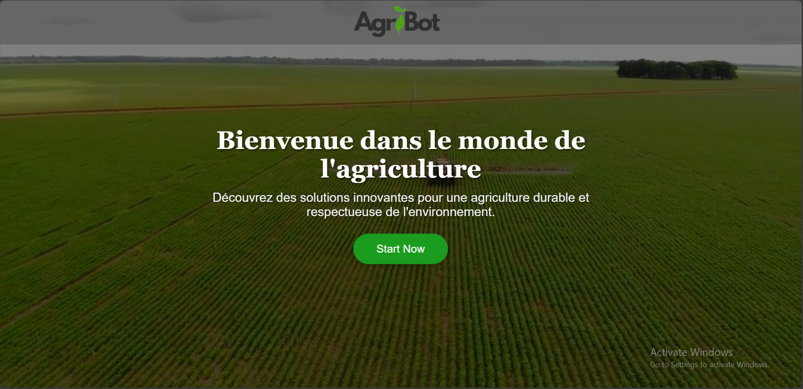

# AgriBot - AI-Powered Agricultural Assistant 🌱🤖

AgriBot is an intelligent chatbot designed to assist farmers and agricultural professionals in diagnosing plant diseases, providing farming advice, and optimizing agricultural practices. Powered by **Google's Gemini API**, AgriBot offers a seamless and professional experience for users to interact with an AI assistant tailored for agriculture.


## Features 🌟

- **Plant Disease Diagnosis**: Upload images of plants to detect diseases, nutrient deficiencies, or pest infestations.
- **Farming Advice**: Get expert recommendations on soil health, irrigation, fertilization, and pest control.
- **Conversation History**: Save and retrieve past conversations for future reference.
- **Multilingual Support**: Responds in the user's preferred language.
- **Image Upload**: Analyze plant images for accurate diagnosis.
- **Markdown Responses**: Display responses in a clean and readable format.


## Technologies Used 🛠️

- **Backend**: Flask (Python)
- **Frontend**: HTML, CSS (Bootstrap), JavaScript
- **AI Model**: Google Gemini API
- **Database**: JSON-based conversation storage
- **File Handling**: Image uploads for disease diagnosis


## Installation and Setup 🚀

### Prerequisites
- Python 3.8 or higher
- A Google Gemini API key (get it from [Google AI Studio](https://ai.google.dev/))
- `pip` for installing dependencies

### Steps

1. **Clone the Repository**
   ```bash
   git clone https://github.com/your-username/AgriBot.git
   cd AgriBot
   ```

2. **Set Up a Virtual Environment**
   ```bash
   python -m venv venv
   source venv/bin/activate  # On Windows: venv\Scripts\activate
   ```

3. **Install Dependencies**
   ```bash
   pip install -r requirements.txt
   ```

4. **Set Up Environment Variables**
   Create a `.env` file in the root directory and add your Gemini API key:
   ```env
   GEMINI_API_KEY=your_api_key_here
   ```

5. **Run the Application**
   ```bash
   python app.py
   ```

6. **Access the Application**
   Open your browser and navigate to:
   ```
   http://127.0.0.1:5000
   ```

---

## Project Structure 📂

```
AgriBot/
├── app.py                  # Flask backend
├── templates/              # HTML templates
│   ├── home.html           # Home page
│   └── index.html          # Chatbot interface
├── static/                 # Static files (CSS, JS, assets)
│   ├── assets/             # Media assets (images, videos)
│   │   ├── images/         # Image files
│   │   └── videos/         # Video files
│   ├── css/                # CSS files
│   │   ├── home.css        # Home page styles
│   │   └── style.css       # Chatbot interface styles
│   └── js/                 # JavaScript files
│       └── index.js        # Frontend logic for the chatbot
├── uploads/                # Folder for uploaded images
├── venv/                   # Virtual environment
├── demo / 
│   ├── AgriBot Demo.mp4                # Demo video
├── conversations.json      # JSON file for storing conversations
├── requirements.txt        # Python dependencies
├── .env                    # Environment variables
└── README.md               # Project documentation
```

---

## API Endpoints 🌐

### 1. **Home Page**
- **GET** `/`
  - Renders the home page (`home.html`).

### 2. **Chatbot Interface**
- **GET** `/chat-bot`
  - Renders the chatbot interface (`index.html`).

### 3. **Upload Image**
- **POST** `/upload_image`
  - Uploads an image for analysis.
  - **Request Body**: `file` (image file)
  - **Response**: 
    ```json
    {
      "message": "File uploaded successfully",
      "file_path": "filename.jpg"
    }
    ```

### 4. **Send Message**
- **POST** `/send_message`
  - Sends a message to the chatbot.
  - **Request Body**:
    ```json
    {
      "user_id": "123",
      "message": "What's wrong with my plant?",
      "image_path": "filename.jpg"  // Optional
    }
    ```
  - **Response**:
    ```json
    {
      "response": "Your plant may have early blight...",
      "history": [...]
    }
    ```

### 5. **Get Conversations**
- **GET** `/get_conversations`
  - Retrieves conversation history for a user.
  - **Query Parameters**: `user_id`
  - **Response**:
    ```json
    {
      "history": [...]
    }
    ```

### 6. **Serve Uploaded Images**
- **GET** `/uploads/<filename>`
  - Serves uploaded images.


## Usage Examples 💡

### 1. **Diagnosing Plant Diseases**
- Upload an image of a plant with yellow spots.
- AgriBot will analyze the image and provide a diagnosis along with treatment recommendations.

### 2. **Getting Farming Advice**
- Ask questions like:
  - "How can I improve soil health?"
  - "What’s the best irrigation method for tomatoes?"
- AgriBot will provide detailed, science-backed answers.

### 3. **Viewing Conversation History**
- Retrieve past conversations to review previous advice or diagnoses.


## Screenshots 📸


*Home Page*


*Chatbot Interface*

## Future Enhancements 🚧

- **User Authentication**: Add login/signup functionality.
- **Multi-Crop Support**: Expand advice for a wider range of crops.
- **Mobile App**: Develop a mobile version for on-the-go access.
- **Integration with IoT Devices**: Connect with sensors for real-time data analysis.


## Contributing 🤝

Contributions are welcome! Please follow these steps:
1. Fork the repository.
2. Create a new branch (`git checkout -b feature/YourFeatureName`).
3. Commit your changes (`git commit -m 'Add some feature'`).
4. Push to the branch (`git push origin feature/YourFeatureName`).
5. Open a pull request.


## License 📜

This project is licensed under the **MIT License**. See the [LICENSE](LICENSE) file for details.


## Acknowledgments 🙏

- **Google Gemini API** for powering the AI.
- **Flask** for the backend framework.
- **Bootstrap** for the frontend design.


## Contact 📧

For questions or feedback, please contact:
- **Your Name**: Saif Iddin Gharbi
- **Email**: seifeddine.gharbi@supcom.tn  
- **GitHub**: [Saif Iddin Gharbi](https://github.com/Saifgharbii)


Happy Farming with AgriBot! 🌾🤖

---
